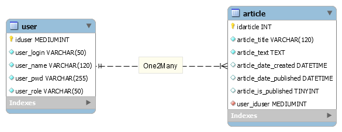

# first-crud-c2-exemple

## Configuration

Importation du fichier `data/mvc2025createread-with-datas.sql` dans votre base de données MariaDB.

## Fichiers de configuration

Dupliquez le fichier `config-dev.php` et renommez-le-en `config-prod.php`. Il se trouve actuellement dans le `.gitignore`, pour des raisons de sécurité.

## Le dossier public 

Le dossier public est la racine de notre site, les utilisateurs ne pourront accéder qu'à ce dossier et ses enfants.

## Identifiants

### Pour se connecter à l'administration

Il faudra se connecter avec un des utilisateurs présents dans la base de données.

### Utilisateurs dans la DB

Les deux premiers sont respectivement le login et le mot de passe non haché.

- `admin` | `lulu25` | `Pitz Michaël` | `admin`
- `modo` | `lala36` | `Sandron Pierre` | `modo`
- `user1` | `use123r` | `Sall Magib` | `redac`

### Notre base de donnée `mvc2025createread`

